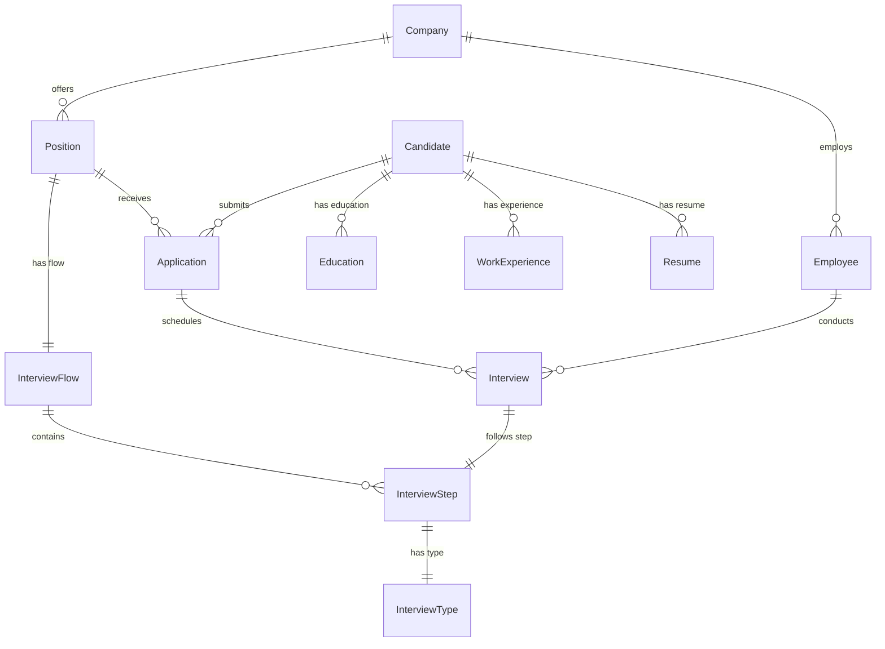

- **ERD_actualizado 17/04/2025:**

```mermaid
erDiagram
    Company ||--o{ Employee : employs
    Company ||--o{ Position : offers
    Position ||--|| InterviewFlow : "has flow"
    InterviewFlow ||--o{ InterviewStep : contains
    InterviewStep ||--|| InterviewType : "has type"
    Position ||--o{ Application : receives
    Candidate ||--o{ Application : submits
    Application ||--o{ Interview : schedules
    Interview ||--|| InterviewStep : "follows step"
    Employee ||--o{ Interview : conducts
    Candidate ||--o{ Education : "has education"
    Candidate ||--o{ WorkExperience : "has experience"
    Candidate ||--o{ Resume : "has resume"
```