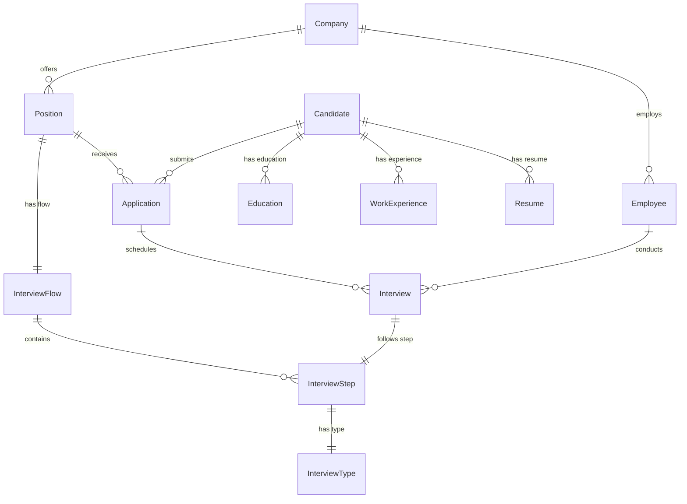

# Sistema de Seguimiento de Talento (LTI-ATS)

## 🎯 Visión General
Sistema de gestión de talento empresarial que implementa las mejores prácticas de arquitectura limpia y Domain-Driven Design (DDD).

## 📑 Documentación Complementaria (Índice)

| Documento | Descripción | Uso e Importancia |
|-----------|-------------|-------------------|
| [PRD - Product Requirements Document](./PRD.md) | Documento de requerimientos del producto | **#Referencia** - Define los requerimientos funcionales y no funcionales del sistema, sirviendo como guía principal para el desarrollo. |
| [Curso: Implementación de BD](./SUMMARY_CURSO.md) | Guía completa de implementación de BD | **#Capacitación** - Material educativo completo para aprender el proceso de implementación de bases de datos escalables para sistemas ATS. |
| [Curso: Debugging y Solución de Problemas](./DEBUGGING_GUIDE.md) | Guía de resolución de problemas | **#Soporte** - Referencia esencial para diagnosticar y resolver problemas comunes en el sistema, reduciendo el tiempo de inactividad. |
| [Proceso de Implementación](./PROCESO_IMPLEMENTACION.md) | Documentación del proceso de implementación | **#Metodología** - Describe el flujo de trabajo seguido para implementar el sistema, útil para nuevos desarrolladores y auditorías. |
| [Verificación con PgAdmin](./PGADMIN_VERIFICACION.md) | Validación de la estructura de BD | **#QA** - Demuestra la correcta implementación de la base de datos, sirviendo como evidencia de calidad. |
| [Guía de Actualización de BD](./DB_UPGRADE_GUIDE.md) | Procedimientos para actualizar la BD | **#Operaciones** - Instrucciones críticas para realizar actualizaciones seguras en la base de datos en producción. |
| [ERD Original](./ERD.md) | Diagrama Entidad-Relación inicial | **#Diseño** - Muestra el diseño conceptual original, útil para entender la evolución del sistema. |
| [ERD Actualizado](./ERD_ACTUALIZADO.md) | Diagrama Entidad-Relación actual | **#Arquitectura** - Refleja la estructura actual de la base de datos, fundamental para el mantenimiento y desarrollo. |

## 🏗️ Arquitectura

```
LTI-ATS/
├── backend/                # Servidor Node.js + Express + TypeScript
│   ├── src/
│   │   ├── domain/        # Entidades y reglas de negocio
│   │   ├── application/   # Casos de uso
│   │   ├── infrastructure/# Implementaciones técnicas
│   │   └── presentation/  # Controladores y rutas
│   └── prisma/           # ORM y esquema de base de datos
└── frontend/             # Cliente React + TypeScript
    └── src/
        ├── components/   # Componentes React
        ├── hooks/       # Custom hooks
        ├── services/    # Servicios API
        └── types/       # Definiciones de tipos
```

## 🔧 Stack Tecnológico

- **Frontend**: React 18, TypeScript, Material-UI
- **Backend**: Node.js, Express, TypeScript
- **Base de Datos**: PostgreSQL 14+
- **ORM**: Prisma
- **Contenedorización**: Docker
- **Testing**: Jest
- **Herramientas Adicionales**: PgAdmin (verificación visual)

## 📊 Modelo de Datos

### Entidades Principales



### Optimizaciones Implementadas

- **Índices Estratégicos**:
  - Búsqueda por email (`Candidate`, `Employee`)
  - Filtrado por estado (`Application`, `Position`)
  - Búsqueda por nombre (`Company`, `Position`)

- **Campos de Auditoría**:
  - `createdAt`, `updatedAt` en todas las tablas
  - Seguimiento de cambios y versiones

## 🚀 Inicio Rápido

1. **Prerequisitos**:
```bash
# Versiones requeridas
node >= 16.x
npm >= 8.x
postgresql >= 14.x
```

2. **Configuración**:
```bash
# Clonar repositorio
git clone [repo_url]
cd LTI-ATS

# Instalar dependencias
cd backend && npm install
cd ../frontend && npm install

# Configurar variables de entorno
cp backend/.env.example backend/.env
```

3. **Base de Datos**:
```bash
# Desde /backend
npx prisma migrate dev
npx prisma generate
```

4. **Ejecutar**:
```bash
# Terminal 1 - Backend
cd backend && npm run dev

# Terminal 2 - Frontend
cd frontend && npm start
```

## 📊 Verificación de Base de Datos

La estructura de la base de datos fue verificada utilizando PgAdmin:

1. **Conexión a PostgreSQL**:
   - Host: localhost
   - Puerto: 5432
   - Base de datos: ai4devs_db
   - Usuario: postgres

2. **Verificación Visual**:
   - Estructura de tablas ✅
   - Relaciones entre entidades ✅
   - Índices estratégicos ✅
   - Restricciones de integridad ✅

Para más detalles sobre la verificación, consulte el documento [Verificación con PgAdmin](./PGADMIN_VERIFICACION.md).

## 📚 Documentación

- [PRD - Product Requirements Document](./PRD.md)
- [Guía de Debugging](./DEBUGGING_GUIDE.md)
- [Proceso de Implementación](./PROCESO_IMPLEMENTACION.md)
- [Verificación con PgAdmin](./PGADMIN_VERIFICACION.md)
- [Guía de Actualización de BD](./DB_UPGRADE_GUIDE.md)
- [ERD Original](./ERD.md)
- [ERD Actualizado](./ERD_ACTUALIZADO.md)

## 🔍 Características Principales

- ✅ Arquitectura limpia y DDD
- ✅ Base de datos optimizada y normalizada
- ✅ API RESTful documentada con OpenAPI
- ✅ Sistema de migraciones automático
- ✅ Gestión completa del ciclo de reclutamiento

## 🤝 Contribución

1. Crear rama feature: `git checkout -b feature/nueva-funcionalidad`
2. Commit cambios: `git commit -am 'feat: agregar nueva funcionalidad'`
3. Push a la rama: `git push origin feature/nueva-funcionalidad`
4. Crear Pull Request

## 📝 Convenciones

- **Commits**: Conventional Commits
- **Código**: ESLint + Prettier
- **API**: REST + OpenAPI 3.0
- **Testing**: Jest + React Testing Library

## 📄 Licencia

MIT © [2025] LTI-ATS